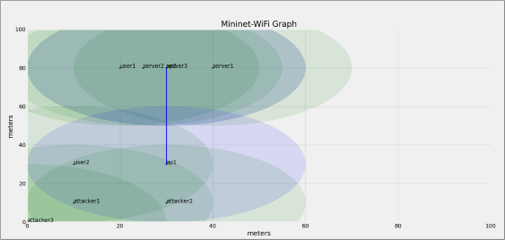
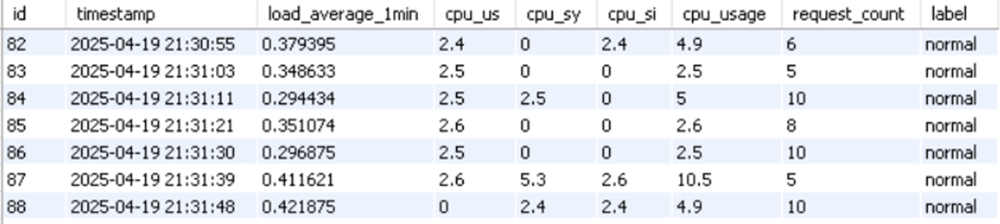
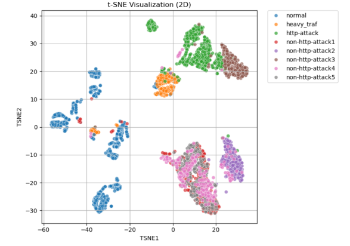

# senior project @EE_cu105

Development of network security testbed for abnormal traffic data detection in cyber attack analysis using machine learning (Year 2) : User service module

I worked together with my team to create a testbed using [Mininet-WiFi](https://mininet-wifi.github.io/get-started/) with Containernet. My role was to manage the Server module. We wanted to simulate how a proxy server works to observe how the server responds to incoming traffic, including attacks. The attacks we focused on were mainly DDoS attacks.

My job was to simulate different kinds of traffic that might happen to the server, store that data in Database (MySQL), find possible server vulnerabilities, and help reduce them by applying machine learning.

## Tech-stack
- Mininet-WiFi
- Virtual Machine (Ubuntu)
- WSL
- Docker
- Nginx
- MySQL & Power BI

## Project overview

We started by practicing how to use all the tools we needed. First, we worked with [**Mininet-WiFi**](https://mininet-wifi.github.io/get-started/) to create network topologies. The picture shown here is a topology plot made with **Matplotlib**.

After creating the topology, I set up a **server inside a container** and used **Containernet** to build a testbed. Once the testbed was running well, we began collecting different types of traffic data, including both **normal and abnormal traffic**. Here is an example of the data we collected:

Next, we started analyzing the collected data to see how the server reacts to different kinds of attacks. We used this analysis to build a **machine learning model** that can **alert us if the server is under attack** at any given time.

Here is an example of the analysis using **t-SNE**, which helps us visualize whether different types of attacks and normal traffic can be separated clearly:

This is just a small part of what I want to show about this project.  
**Thank you to everyone who showed interest, and thanks to the team for doing their part well to make this project a success.**
